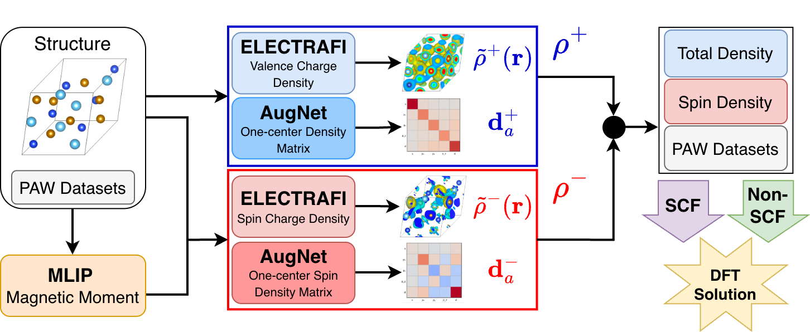

# Neural Electronic Initialization

Code for "Complete Neural Electronic Initialization Accelerates Materials DFT"
([arXiv:2609.21759](https://arxiv.org/abs/2609.21759)), packaged as one installable distribution,
`neural_paw_dft`, with an end-to-end inference pipeline:

structure (or CHGCAR) → ELECTRAFI total + spin density grids, AugNet PAW augmentation
occupancies, CHGNet site moments → a VASP-ready directory (`CHGCAR`, `INCAR` with
`ICHARG=1`, `POSCAR`, `POTCAR`, `KPOINTS`).

> [!WARNING]
> The code used to produce the paper's results is in the `v1` branch (tag `v1-paper`). There are no
> numerical differences at the moment, but we do not guarantee that results stay identical as the code
> on `main` continues to develop.



## Layout

```
.
├── neural_paw_dft/           the installable package
│   ├── spin_electrafi/       ELECTRAFI adapted for spin-difference densities (EScAIP backbone)
│   ├── augnet/               AugNet: augmentation occupancies from a MACE backbone
│   ├── vasp_runner/          CHGCAR channel surgery, INCAR/OSZICAR helpers, VASP experiment plumbing
│   ├── pipeline/             the inference workflow, YAML config and the `ndi` CLI
│   └── models.py             registry of weight files (names -> paths under the weights directory)
├── experiments/              training runs, SLURM submitters and report scripts for the paper (not installed)
├── trained_models/           model weights (not tracked; see below)
└── tests/
```

Each subpackage keeps its original README under `experiments/<name>/README.md`; the training and
evaluation commands there now run from `experiments/<name>/` against the installed package
(`python experiments/augnet/train.py ...`, `ndi-augnet-train ...`, `ndi-electrafi-train ...`).

## Installation

Python >= 3.10. Pick the torch wheel matching your CUDA first, or skip that line for PyPI's default build.

```bash
pip install "torch>=2.4.1" --index-url https://download.pytorch.org/whl/cu124   # optional
pip install -e .
```

Or with [uv](https://docs.astral.sh/uv/) from the committed `uv.lock`:

```bash
uv sync
uv run ndi --version
```

Extras: `train`, `cueq` / `cueq-cuda` (only for training AugNet or loading the original `.ckpt` files),
`oeq`, `mp`, `examples`, `dev`. `pykeops` needs a C++ compiler at runtime.

### Weights

Weights are not in the repository. They are published as inference-only `safetensors` at
[huggingface.co/faerte/neural_paw_dft](https://huggingface.co/faerte/neural_paw_dft) and are
downloaded on first use into the weights directory: `weights_dir` in the YAML, else
`NDI_WEIGHTS_DIR`, else `trained_models/` (the default when installed editable). The layout is
flat, one file per registry name (`neural_paw_dft/models.py`):

```
trained_models/augnet_total_full.safetensors        (+ augnet_total_full.config.json sidecar)
trained_models/augnet_spin_full.safetensors         (+ sidecar)
trained_models/electrafi_total.safetensors
trained_models/electrafi_spin_constrained.safetensors
...
```

Registry names are `electrafi_total`, `electrafi_total_v2`, `electrafi_spin_constrained`,
`electrafi_spin_unconstrained`, `augnet_total_{full,50k,10k,1k}` and `augnet_spin_full`. Any
config entry also accepts a plain path; the original Lightning `.ckpt` / `.model_state_dict`
training checkpoints still load that way (AugNet `.ckpt`s need `cuequivariance`). The published
AugNet weights are in plain e3nn layout, so `augnet.enable_cueq` must stay unset for them.

## Usage

```bash
ndi config-template > ndi.yaml           # edit: potcar_dir, grid_dims or vasp_cmd, device, ...
ndi build POSCAR --config ndi.yaml --out fe2o3_seed/
ndi build CHGCAR.lz4 --config ndi.yaml   # structure and NGX/NGY/NGZ taken from the CHGCAR
ndi predict POSCAR --grid 60 60 60 --out preds/   # grids (.npy) and augmentation (.npz) only
```

`ndi build` writes `INCAR`/`POSCAR`/`POTCAR`/`KPOINTS` with pymatgen's `MPStaticSet`
(`ICHARG=1`, `ISTART=0`, `LCHARG=.TRUE.`, `MAGMOM` from CHGNet; `POTCAR.spec` instead of `POTCAR` when no
POTCAR library is configured), then the `CHGCAR`, then
`ndi_prediction.json` (NELECT, integrals, moments, weights used). It never submits or runs the
calculation. The FFT grid comes from, in order: `grid_dims` / `--grid`, a CHGCAR input,
`NGXF/NGYF/NGZF` in `incar_overrides`, or, if `vasp.vasp_cmd` is set, a one-step VASP dry run.

Both subcommands also take `--device`, `--weights-dir`, `--no-spin` and `--no-chgnet`; `build` additionally
takes `--incar KEY=VAL ...` for INCAR overrides applied last. `--no-spin` writes a charge-only seed and, when
the configured ELECTRAFI checkpoint is one of the registry spin models, swaps it for `electrafi_total`.

Python:

```python
from neural_paw_dft.pipeline import Pipeline, load_config

pipe = Pipeline(load_config("ndi.yaml"))
pipe.build("POSCAR", "fe2o3_seed")            # full directory
pred = pipe.predict("POSCAR", grid_dims=(60, 60, 60))   # arrays only: pred.rho_total, pred.aug_total, ...
```

CHGNet moments are unsigned; the spin constraint passed to the constrained ELECTRAFI arm is their
sum (the paper's convention). Set `chgnet.enabled: false` or `--no-chgnet` to skip both; with the
constrained spin model that is an error unless you also pass `site_moments` yourself or switch to
`electrafi_spin_unconstrained`, since its spin amplitude is only meaningful once pinned to a net moment.

## Example notebook

`examples/demo.ipynb` runs the whole thing on bcc Fe on CPU: CHGNet moments, ELECTRAFI grids,
AugNet occupancies, and a `CHGCAR` written to `examples/demo_out/` (`pip install -e ".[examples]"`).

## Citation

If you use this work, please cite:

> Ærtebjerg, Felix, et al. "Complete Neural Electronic
> Initialization Accelerates Materials DFT." *arXiv preprint* arXiv:2609.21759 (2026).

```bibtex
@article{aertebjerg2026complete,
  title   = {Complete Neural Electronic Initialization Accelerates Materials DFT},
  author  = {{\AE}rtebjerg, Felix and Elsborg, Jonas and Bhowmik, Arghya},
  journal = {arXiv preprint arXiv:2609.21759},
  year    = {2026}
}
```
